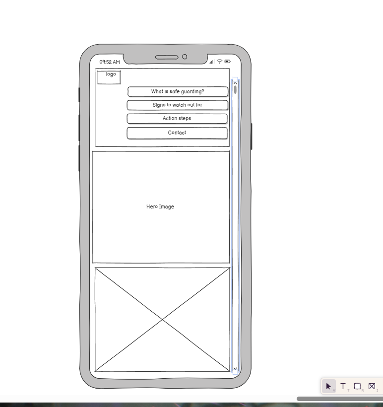
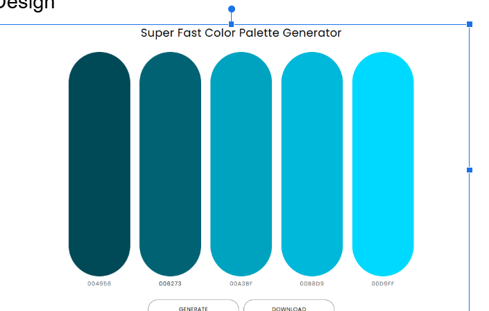
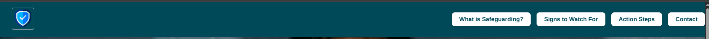
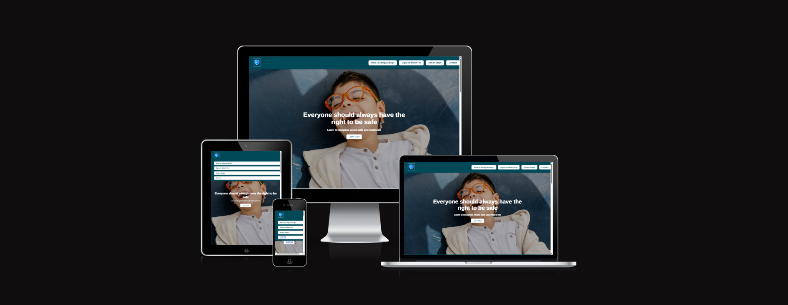
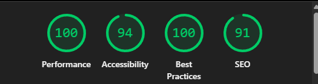

# Safeguarding Awareness Website

## Table of Contents

1. [Design & Planning](#design--planning)  
   - [User Stories](#user-stories)  
   - [Wireframes](#wireframes)  
   - [Typography](#typography)  
   - [Colour Scheme](#colour-scheme)  
2. [Features](#features)  
   - [Navigation](#navigation)  
   - [Footer](#footer)  
   - [Home Page](#home-page)  
   - [Other Features](#other-features)  
3. [Technologies Used](#technologies-used)  
4. [Testing](#testing)  
   - [Google Lighthouse Performance](#google-lighthouse-performance)  
   - [Browser Compatibility](#browser-compatibility)  
   - [Responsiveness](#responsiveness)  
   - [Code Validation](#code-validation)  
   - [Manual Testing](#manual-testing)  
5. [Bugs](#bugs)  
6. [Deployment](#deployment)  
7. [Credits](#credits)  

---

## Design & Planning

### User Stories
## User Stories

###  User Story 1: Understand What Safeguarding Is (Must-Have)
**As a** concerned visitor,  
**I want** a simple explanation of what safeguarding is,  
**So that** I can quickly understand its purpose and importance.

**Acceptance Criteria:**
- Clear definition of safeguarding shown near the top of the site.
- Avoids complex terms or jargon.
- Includes who safeguarding applies to (e.g., children, vulnerable adults).

---

###  User Story 2: Recognise the Signs of Abuse or Neglect (Must-Have)
**As a** parent, teacher, or carer,  
**I want** to see a list of common signs of abuse or neglect,  
**So that** I can identify if someone may be at risk.

**Acceptance Criteria:**
- “Signs to Watch For” section includes visual cues or bullet points.
- Covers emotional, physical, and behavioral signs.
- Content is accessible and readable across devices.

---

### User Story 3: Know What Steps to Take in a Safeguarding Situation (Must-Have)
**As a** member of the public,  
**I want** to know what to do if I have a safeguarding concern,  
**So that** I can respond correctly and responsibly.

**Acceptance Criteria:**
- “Action Steps” section includes clear, numbered instructions.
- Includes contact details or guidance for escalation.
- Reassures user that acting on concern is the right thing to do.

---

###  User Story 4: Access the Website Easily on Any Device (Must-Have)
**As a** mobile or tablet user,  
**I want** the site to work smoothly on all devices,  
**So that** I can read and scroll without any layout issues.

**Acceptance Criteria:**
- Site uses responsive Bootstrap layout.
- Text, buttons, and links are sized for small screens.
- No horizontal scrolling or layout breaks on mobile.

---

###  User Story 5: Contact the Right Person in a Crisis (Should-Have)
**As someone** with an urgent safeguarding concern,  
**I want** to quickly find contact details for relevant safeguarding authorities,  
**So that** I can report my concern without delay.

**Acceptance Criteria:**
- Contact section includes phone numbers, email, or links to local authorities.
- Easy to find from any point on the page (via navbar or link).
- Styled clearly to draw attention.

---

###  User Story 6: Learn Who Safeguarding Protects (Should-Have)
**As a** curious visitor,  
**I want** to know who is protected by safeguarding policies,  
**So that** I understand why it's necessary and who benefits from it.

**Acceptance Criteria:**
- The “What is Safeguarding?” section or a callout box mentions groups at risk (e.g., children, elderly, disabled).
- May include short examples or icons for clarity.

---

###  User Story 7: Feel Empowered to Act (Could-Have)
**As a** bystander,  
**I want** to feel encouraged and confident about reporting concerns,  
**So that** I don’t second-guess myself or stay silent.

**Acceptance Criteria:**
- Action section includes a positive, encouraging message.
- *Optional:* Include a real-life quote or testimonial about successful safeguarding intervention.

### Wireframes

This wireframe shows the **mobile layout** for the Safeguarding Awareness website. It includes:

- A fixed logo area at the top  
- Navigation buttons for key sections  
- A central hero image area  
- Space for content and imagery below

### ✍️ Typography

The project uses Google Fonts for consistency, clarity, and accessibility.

- **Body & UI Text Font:** [Arimo](https://fonts.google.com/specimen/Arimo)  
  A clean, professional sans-serif font that improves readability, especially on smaller screens.

- **Weight Used:** 400 (regular), 700 (bold)

### 🎨 Colour Scheme

The following color palette was generated using [Super Fast Color Palette Generator](https://www.colourpalettegenerator.com/) and is used throughout the Safeguarding Awareness website for consistent branding and visual clarity:

| Color Name | Hex Code | Usage |
|------------|----------|-------|
| Dark Teal  | `#004956` | Navigation bar, footer background |
| Teal       | `#006273` | Button backgrounds, links |
| Light Teal | `#00A3BF` | Section highlights, borders |
| Cyan       | `#00B8D9` | Hover effects, icons |
| Bright Blue| `#00D9FF` | Call-to-action buttons, accents |

#### Colour Palette Preview:

###  Favicon

A custom **favicon** (short for "favorite icon") has been added to the website to improve branding and user experience. It appears in the browser tab and bookmarks.

## Features

###  Navigation

The site features a fixed top navigation bar for quick access to key sections of the site. It includes:

- A **logo** on the left side for brand identity.
- Four main links:
  - **What is Safeguarding?**
  - **Signs to Watch For**
  - **Action Steps**
  - **Contact**
- Each link uses anchor tags to smoothly scroll to the corresponding section on the page.
- The navigation menu is **fully responsive**, adjusting to different screen sizes and stacking into a vertical menu on mobile devices.

#### Navigation Preview:

### Footer

- Copyright notice

### Home Page

- Hero section with motivational headline:  
  _"Everyone should always have the right to be safe"_
- Supporting text and "Learn More" CTA button
- Full-screen background image for emotional impact

### Other Features

- Scroll animations
- Clickable anchor links for quick access
- External resource links
- Responsive design across all devices

## Technologies Used

- **HTML5** – Structure and semantic layout of web pages  
- **CSS3** – Custom styling and layout design  
- **Bootstrap 5** – Responsive grid system and prebuilt components  
- **Google Fonts** – For clean, accessible typography (Arimo, Montserrat, Roboto)  
- **Font Awesome** – Icon library used for interface elements  
- **Git** – Version control to track changes locally  
- **GitHub** – Remote code repository and GitHub Pages deployment  
- **Gitpod** – Online IDE used for writing and testing code  
- **W3C Validators** – Used to validate HTML and CSS for standards compliance  
- **ami.responsivedesign.is** – For displaying responsive design mockups  
- **BrowserStack (breakpoints guide)** – Reference for responsive design across devices  

## Testing

### Google Lighthouse Performance

> Add screenshots of results (mobile & desktop)

### Browser Compatibility

Tested on:

- Chrome   
- Edge  git

### 📱 Responsiveness

The Safeguarding Awareness website has been designed to work across a variety of screen sizes and devices, including:

- Mobile phones (320px+)
- Tablets (768px+)
- Laptops and desktops (1024px–1920px+)

This was achieved using a responsive **Bootstrap 5 layout** and custom media queries for fine-tuning.

#### Responsive Layout Preview:

### ✅ Code Validation

All HTML and CSS files were checked using the official [W3C Markup Validation Service](https://validator.w3.org/) and [W3C CSS Validation Service](https://jigsaw.w3.org/css-validator/).

- ✅ **HTML Validation**: No errors or warnings found
- ✅ **CSS Validation**: No errors or warnings found

#### Validation Screenshots:

**HTML Validation**

**CSS Validation**

### Manual Testing

| User Story | Test Description | Pass |
|------------|------------------|------|
| US1        | Loads homepage on mobile | ✓ |
| US2        | All nav links scroll to correct section | ✓ |
| US3        | Contact form (if included) works | ✓ |

---

## Bugs

- no major bugs due to validation checks
---

## Deployment

### GitHub Repository Creation

1. Forked Code Institute's template  
2. Created a new repository from template  
3. Opened project in Gitpod  
4. Pushed code regularly with meaningful commits

### GitHub Pages Deployment

1. Navigate to your repository  
2. Go to **Settings > Pages**  
3. Select `main` branch as source  
4. Click **Save**  
5. Your site will be published at:  
   `https://yourusername.github.io/safeguarding-project/`

  ##  Live Site

This is my deployed Safeguarding Awareness website:  
👉 [Click here to view the live site](https://anaseljandi.github.io/safeguarding-project/)

##  Credits

###  Code & Development Resources

- [MDN Web Docs](https://developer.mozilla.org/) – reference for HTML/CSS/JavaScript syntax
- [Bootstrap](https://getbootstrap.com/) – responsive grid system and UI components
- [GitHub](https://github.com/) – project version control and hosting
- ChatGPT – used for guidance, planning, and markdown structure assistance

### Media & Imagery

- [Pexels](https://www.pexels.com/) – free stock images
- [iStock](https://www.istockphoto.com/) – commercial-quality stock imagery
- [Unsplash](https://unsplash.com/) – high-quality open-license images

###  Fonts & Visual Tools

- [Google Fonts](https://fonts.google.com/) – used for font integration (Arimo, Montserrat, Roboto)
- [Colour Palette Generator](https://www.colourpalettegenerator.com/) – created accessible and consistent color themes

###  Responsiveness & Testing

- [ami.responsivedesign.is](https://ui.dev/amiresponsive) – generated device mockups to showcase responsiveness
- [BrowserStack – Responsive Design Breakpoints](https://www.browserstack.com/guide/responsive-design-breakpoints) – reference guide for device sizes and breakpoints

### Acknowledgments

- [Code Institute](https://codeinstitute.net/) – template and educational support
- Mentors and classmates – peer feedback and code review
- [Stack Overflow](https://stackoverflow.com/) – technical solutions and troubleshooting

## 🚦 Lighthouse Performance

[Lighthouse](https://developer.chrome.com/docs/lighthouse/overview/) was used in **Google Chrome DevTools** to evaluate the overall quality and performance of the site on both mobile and desktop devices.

### 💻 Desktop Report

- The website ran well in the desktop report meaning it is very responsive and able to be used!

